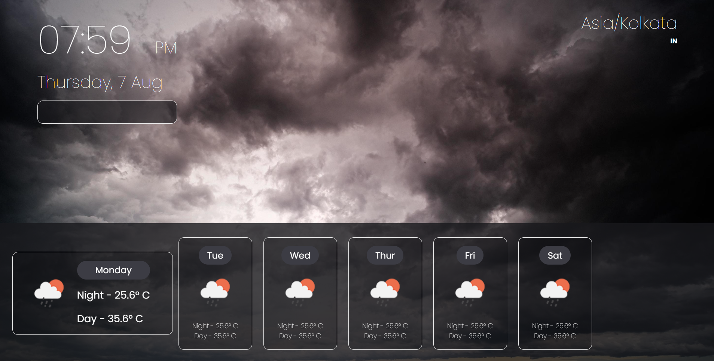

# 🌤️ Weather Forecasting Webpage

This is a simple and responsive weather forecasting webpage built using **HTML**, **CSS**, and **JavaScript**. It allows users to search for any city and view real-time weather data such as temperature, humidity, wind speed, and conditions.

## 📌 Features

- 🌍 City-based weather search
- ☁️ Real-time weather info using OpenWeatherMap API
- 📱 Responsive design for mobile and desktop
- 🌡️ Displays temperature, humidity, wind speed, and icons for weather conditions

## 🛠️ Technologies Used

- HTML
- CSS
- JavaScript
- OpenWeatherMap API

## 📷 Screenshot

